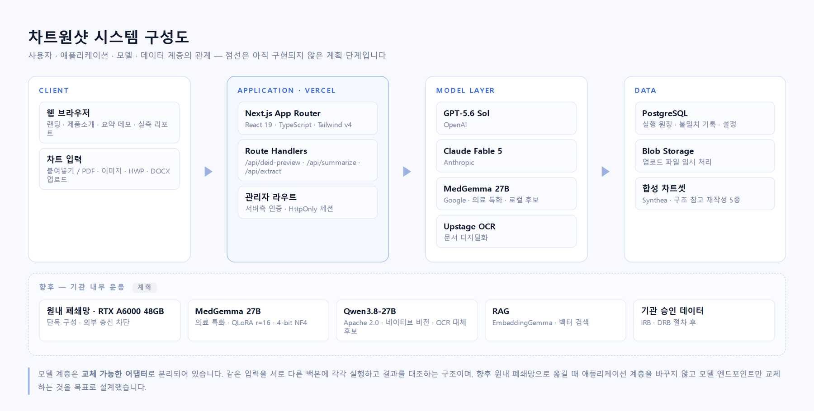
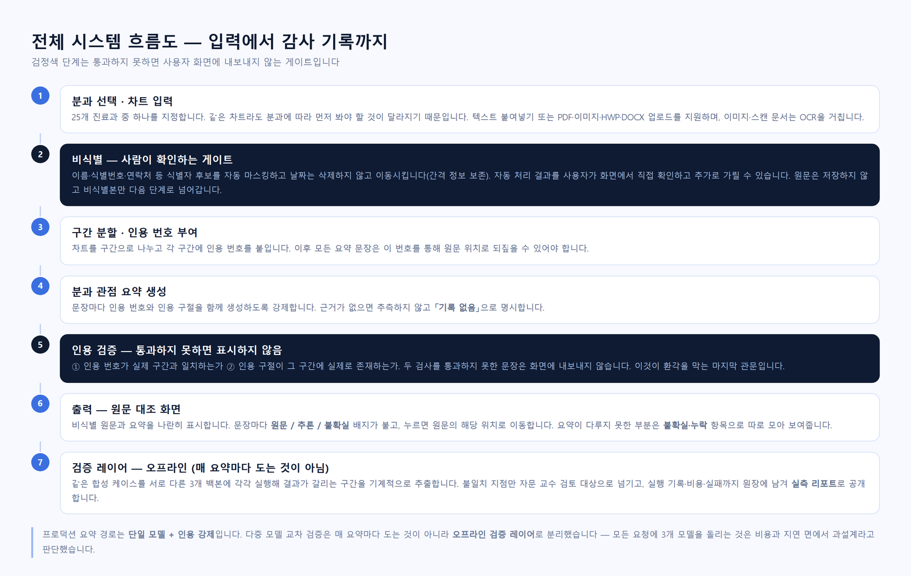

# 차트원샷 · ChartOneShot

> **길고 복잡한 차트에서, 내 분과에서 필요한 것만.**
> 그리고 **믿을 수 없는 문장은 화면에 내보내지 않습니다.**

여러 차수에 걸쳐 누적된 한국어 EMR을 **분과 관점의 한 장**으로 정리하는 의료 AI입니다.
저희가 우선한 것은 속도가 아니라 **근거를 확인할 수 있는 요약**입니다.
표시하는 문장에는 원문 인용을 붙이고, 근거를 확인하지 못한 문장은 내보내지 않으며,
기록에 없는 것은 지어내지 않고 **「기록 없음」으로 적습니다.**

🔗 **Live · https://chartoneshot.com**
🎬 **시연 영상 · [6. 소개 및 시연 영상](#6-소개-및-시연-영상)**
🚀 **향후 계획 · [4. 기술 로드맵과 사업화](#4-향후-계획--기술-로드맵과-사업화)**

<sub>제7회 PNU 창의융합AI해커톤 · 창업트랙 05조 · Team Golden Time · 부산대학교</sub>

---

## 📌 이 저장소에 대하여 (먼저 읽어주세요)

팀이 **창업을 준비 중**이라 **일부를 제외하고 공개**합니다.

| | 내용 |
|---|---|
| **공개** | 결과 보고서 · 요구사항(PRD) · 데이터 모델(ERD) · 기능명세서 · 개발 기록 · 문제 기록 · 시스템 구성도/흐름도 · 제품 UI 코드 · 핵심 로직 코드 발췌와 테스트 · 합성 차트 데이터 |
| **비공개** | 프롬프트 설계 · 검증 파이프라인 내부 구현 · 다중 모델 교차 검증 구현 · 사업 문서 |

공개된 UI 코드는 **2026년 7월 시점 기준**이며, 이후의 화면 개편과 검증 기능은
라이브 사이트에만 반영돼 있습니다.

**대신 동작은 전부 확인하실 수 있습니다.** 라이브 사이트(https://chartoneshot.com)에서
비식별부터 요약, 근거 대조까지 실제로 돌려보실 수 있고, 저희가 돌린 실행 기록은
[실측 리포트](https://chartoneshot.com/evidence)에 **실패한 실행까지 포함해** 공개돼 있습니다.
심사에 필요하시면 코드는 별도로 제공하겠습니다.

---

## 1. 프로젝트 소개

### 1.1. 개발배경 및 필요성

**① 기록은 쌓이는데, 읽을 시간은 늘지 않습니다.**
한 환자의 EMR에는 여러 차수의 외래·입원 기록이 누적되고, 한국어 약어와 영어 용어가
뒤섞인 길고 반복적인 텍스트가 쌓입니다. 의사가 복잡한 케이스 하나를 검토하는 데
평균 **약 25분**이 소요된다는 보고가 있습니다.
*(Nolan et al., Mayo Clinic 디지털 설문연구, Applied Clinical Informatics, 2017)*

**② 복사·붙여넣기로 상충 기록이 누적됩니다.**
차트에는 이전 기록을 그대로 옮겨 적은 문장이 쌓이고, 그 과정에서 서로 맞지 않는 내용이
남습니다. 예를 들어 *"알레르기 없다고 진술함"* 옆에 *"타원 기록에는 조영제 발진 기재 있음"*
같은 문장이 함께 존재합니다. 급할수록 이런 한 줄을 놓치기 쉽습니다.

**③ 경험이 적을수록 더 어렵습니다.**
임상실습 의대생·전공의는 차트를 빠르게 훑는 경험이 부족해, 확인해야 할 흐름을 놓치기
쉽습니다.

**④ 그런데 의료 AI의 진짜 문제는 속도가 아닙니다.**
요약을 만드는 것 자체는 이제 어렵지 않습니다. 문제는 **그 요약을 믿을 수 있는가**입니다.
그럴듯하지만 원문에 없는 문장(환각), 조용히 빠진 항목(누락), 애매한데 단정적으로 쓰는
문장 — 이 세 가지가 임상에서 가장 위험합니다.

**⑤ 환자 정보는 밖으로 나갈 수 없습니다.**
환자 정보는 외부 반출이 제한되어, 일반적인 클라우드 서비스를 그대로 적용하기 어렵습니다.

### 1.2. 개발 목표 및 주요 내용

| 목표 | 구체적 내용 |
|---|---|
| **분과 관점 요약** | 같은 차트라도 분과에 따라 먼저 봐야 할 것이 다릅니다. 25개 진료과 중 지정한 관점으로 정리합니다 |
| **근거 강제** | 요약 문장마다 원문 인용을 붙이고, **검증에 실패한 문장은 화면에 내보내지 않습니다** |
| **불확실성 노출** | 원문 / 추론 / 불확실을 구분 표시하고, 요약이 다루지 못한 부분을 별도로 모아 보여줍니다 |
| **기록 없음 명시** | 근거가 없으면 추측하거나 공란으로 두지 않고 **「기록 없음」으로 적습니다** |
| **감사 가능성** | 실행 기록·비용·불일치·실패를 원장에 남기고 공개합니다 |
| **데이터 주권** | 기관 내부 폐쇄망에서 운용 가능한 구조로 이행 — RTX A6000 48GB 단독 구성 목표 *(계획 단계 · [4장](#4-향후-계획--기술-로드맵과-사업화))* |

### 1.3. 세부내용

**입력** — 텍스트 붙여넣기, PDF·이미지·HWP·DOCX 업로드. 스캔 문서는 OCR을 거칩니다.
합성 차트 샘플 5종을 내장해 바로 체험할 수 있습니다.

**비식별** — 이름·식별번호·연락처 등 식별자 후보를 자동 마스킹합니다. 날짜는 **삭제하지 않고
이동**시켜 검사 간격 정보를 보존합니다. 자동 처리 결과를 사용자가 화면에서 직접 확인하고
추가로 가릴 수 있으며, **원문은 저장하지 않고 비식별본만** 다음 단계로 넘어갑니다.

**요약** — 차트를 구간으로 나눠 인용 번호를 부여하고, 문장마다 인용 번호와 인용 구절을
함께 생성하도록 강제합니다.

**인용 검증** — ① 인용 번호가 실제 구간과 맞는가 ② 인용 구절이 그 구간에 실제로 있는가.
**두 검사를 통과하지 못한 문장은 표시하지 않습니다.**

**출력** — 비식별 원문과 요약을 나란히 놓고, 문장을 누르면 원문의 해당 위치로 이동합니다.
검사 수치는 시간에 따른 변화로 함께 제시합니다.

**검증 레이어(오프라인)** — 같은 합성 케이스를 서로 다른 3개 백본에 각각 실행해 결과가
갈리는 구간을 기계적으로 추출합니다. 불일치 지점만 자문 교수 검토 대상으로 넘깁니다.

### 1.4. 기존 서비스 대비 차별성

| 구분 | 일반적인 AI 요약 | **차트원샷** |
|---|---|---|
| 근거 제시 | 요약문만 제공 | 문장마다 **원문 인용을 함께 표시** |
| 근거 추적 | 어려움 | 문장을 누르면 **원문 해당 위치로 이동** |
| 검증 실패 시 | 그대로 출력 | **화면에 내보내지 않음** |
| 근거가 없을 때 | 그럴듯하게 채움 | **「기록 없음」으로 명시** |
| 불확실성 | 드러나지 않음 | **원문 / 추론 / 불확실** 구분 표시 |
| 누락 | 알기 어려움 | 다루지 못한 부분을 **별도 항목으로 노출** |
| 검증 | 자체 판단 | 합성 케이스를 **3개 백본에 각각 실행해 대조** |
| 실패 공개 | 안 함 | **실패한 실행·지난 오판까지 공개** |

**가장 큰 차이는 마지막 줄입니다.** 저희는 [실측 리포트](https://chartoneshot.com/evidence)에
*"우리 모델이 어디서 무너지는지"* 를 먼저 적습니다. 특정 모델이 케이스 하나에서 **실행에
실패한 기록**, 놓친 항목 수, 저희가 원인을 잘못 짚었다가 정정한 기록까지 그대로 남깁니다.

> 검증과 감사를 앞세우는 팀이 실패를 감추면, 그 주장 자체가 무너집니다.
> 그래서 **부끄러운 기록도 남기는 것**을 제품의 일부로 삼았습니다.

### 1.5. 사회적가치 도입 계획

| 가치 | 계획 |
|---|---|
| **환자 안전** | 근거 제시·불확실성 표시·누락 노출로 오판 가능성을 줄이는 방향. 다만 임상적 유효성은 **아직 검증되지 않았습니다** |
| **의료 형평성** | 차트 판독 경험이 적은 의대생·전공의의 학습과 확인을 지원 |
| **개인정보 보호** | 비식별 후 처리, 원문 미저장. 사람이 확인하는 게이트를 필수 단계로 배치 |
| **데이터 주권** | 환자 데이터와 모델 가중치가 기관 밖으로 나가지 않는 원내 폐쇄망 구성을 목표 *(계획 단계)* |
| **정직한 기록** | 문제·실패·오판을 공개 기록으로 남겨, 검증 가능한 의료 AI의 사례를 만드는 것 |

> **고지** — 본 프로젝트는 연구·개발 단계입니다. 진료 판단을 대체하지 않으며,
> 의료기기로 개발된 것이 아닙니다. 임상적 유효성은 검증되지 않았습니다.
> 공개된 모든 데이터는 합성 차트이며 실제 환자 정보(PHI)를 포함하지 않습니다.

---

## 2. 상세설계

### 2.1. 시스템 구성도



점선 영역은 **아직 구현되지 않은 계획 단계**입니다.
모델 계층은 교체 가능한 어댑터로 분리되어 있어, 향후 원내 폐쇄망으로 옮길 때
애플리케이션 계층을 바꾸지 않고 모델 엔드포인트만 교체하는 것을 목표로 설계했습니다.

### 2.2. 사용 기술

**Frontend**

| 기술 | 버전 |
|---|---|
| Next.js (App Router) | 16.2.3 |
| React | 19.2.4 |
| TypeScript | 5.x (strict) |
| Tailwind CSS | v4 |
| Framer Motion | 12.x |
| lucide-react | 0.460 |

**Backend / Infra**

| 기술 | 용도 |
|---|---|
| Next.js Route Handlers | 서버리스 API |
| Vercel | 배포 · 서버리스 실행 |
| PostgreSQL (Supabase) | 실행 원장 · 불일치 기록 · 설정 |
| Vercel Blob | 업로드 파일 임시 처리 |
| Vercel AI SDK (`ai` v6) | 모델 어댑터 추상화 |

**AI · 생성형 모델 (제품)**

| 역할 | 모델 |
|---|---|
| 요약 (프로덕션 경로) | 상용 LLM API — 구조화 출력 + 인용 강제 |
| 교차 검증 백본 ① | **GPT-5.6 Sol** (OpenAI) |
| 교차 검증 백본 ② | **Claude Fable 5** (Anthropic) |
| 교차 검증 백본 ③ | **MedGemma 27B** (Google · 의료 특화 · 로컬 운용 후보) |
| 문서 디지털화 | Upstage OCR |
| 온프렘 후보 ① | **MedGemma 27B** — 의료 특화 |
| 온프렘 후보 ② | **Qwen3.8-27B** — Apache 2.0 · 27B dense · 262K 컨텍스트 · 네이티브 비전 |
| 온프렘 구성 | QLoRA(r=16, 4-bit NF4) · vLLM · RAG(EmbeddingGemma) · **RTX A6000 48GB 단독** |

**AI 코딩 도구 (개발)**

| 도구 | 용도 |
|---|---|
| **Claude Code** | 주 개발 도구 — 설계·구현·리팩터링·테스트 작성 |
| **교차 리뷰 (다른 계열 코딩 모델)** | 스스로 놓친 결함 점검 |

**품질 관리**

- TypeScript strict 모드
- 자동화 테스트 **197 passed / 2 skipped (30개 파일)** — 2026-08-23 실행 기준
- 배포 전 타입 검사 · 프로덕션 빌드 · 테스트 통과를 필수 절차로 운영

---

## 3. 개발결과

### 3.1. 전체시스템 흐름도



검정색 단계(**② 비식별**, **⑤ 인용 검증**)는 통과하지 못하면 사용자 화면으로 내보내지 않는
게이트입니다. 프로덕션 요약 경로는 **단일 모델 + 인용 강제**이고, 다중 모델 교차 검증은
매 요약마다 도는 것이 아니라 **오프라인 검증 레이어**로 분리했습니다 — 모든 요청에 3개
모델을 돌리는 것은 비용과 지연 면에서 과설계라고 판단했습니다.

### 3.2. 기능설명

#### `/` — 랜딩

프로젝트 개요와 미션을 소개합니다. `지금 체험하기`는 요약 데모로, `작동 원리 보기`는
제품 소개로 이동합니다.

#### `/submit` — 차트 요약 (핵심 기능)

**3단계 플로우입니다.**

**STEP 1 · 분과 선택** — 5개 계열 아래 25개 진료과가 아코디언으로 정리돼 있습니다.
선택하지 않으면 다음 단계로 넘어가지 않습니다.

**STEP 2 · 차트 입력** — 붙여넣기 / 합성 샘플 5종 불러오기 / 파일 업로드(PDF·이미지·HWP·DOCX).
*"입력 내용이 실제 환자 정보가 아닌 가상·합성 차트임을 확인"* 하는 동의 체크가 **필수**이며,
체크하지 않으면 `비식별 확인` 버튼이 활성화되지 않습니다.

**STEP 2.5 · 비식별 확인 (사람 게이트)** — 식별자 후보를 자동으로 찾아 `███`로 가리고
날짜를 시프트한 결과를 보여줍니다. *"식별자 후보 N건을 가리고 날짜를 시프트했어요"* 로
처리 내역을 알리고, 사용자가 **드래그로 추가 마스킹 / 되돌리기 / 처음으로** 를 할 수 있습니다.

**STEP 3 · 분과별 요약 결과** — 좌측 비식별 원문 · 우측 요약의 Split View.

- **즉시 확인** — 지금 바로 판단이 필요한 항목을 최상단에 별도 표시
- **핵심 문제** — 이 환자의 주된 상황을 한 단락으로
- 주요 수치 칩 · **투약·치료 변경** 시계열
- **불확실·누락** — 요약이 다루지 못했거나 기록에 없는 항목을 따로 모음
- **분과 관점** — 해당 분과 의사결정에 추가로 필요한 내용
- 문장마다 `원문` / `추론` / `불확실` 배지, 클릭 시 원문 위치로 이동
- **slop-린트** — 요약문 자체의 품질 결함(수치 없는 검사 언급, 시점 없는 추세 서술 등)을
  자동 검출해 상단에 표시합니다. **자기 출력을 스스로 감점하는 장치입니다.**

#### `/product` — 제품 소개

검증·감사 하네스 구조(3-Model Peer Review 파이프라인), 저희가 실제로 돌린 실행 기록
요약표, 4가지 핵심 기능, 처리 흐름, 지표, 인터랙티브 데모, Doctor Challenge를 담았습니다.

#### `/evidence` — 실측 리포트 ★

**합성 4케이스 × 3모델**의 실행 결과를 표로 공개합니다. 문장 수, 소요 시간, 비용,
원문/추론/불일치 건수, 인용 검증 통과율, 놓친 항목 수까지 **기계가 뽑은 값 그대로** 싣습니다.
특정 모델이 한 케이스에서 **실행에 실패한 기록**도 지우지 않고 남겼습니다.
아래에는 모델별 특성을 실제 출력 문장으로 비교하고, **저희가 잘못 판단했다가 정정한 기록**을
날짜와 함께 남겼습니다.

#### `/peer-review` — 3-Model 라이브 *(관리자 인증)*

서버측 인증 뒤에서만 동작하는 실행·비교 화면입니다. 검색 색인에서 제외했습니다.

#### `/team` — About us

팀 소개와 진행 경과.

#### `/admin` — 관리자 콘솔 *(서버측 인증)*

설정 편집(백본·모델·단가) · 관측 패널 · 실행 원장 · 케이스 재실행.
네비게이션에 노출하지 않고 푸터 링크로만 접근하며, 비밀번호는 **서버측에서 검증**하고
HttpOnly 세션 쿠키를 사용합니다. 서버 환경변수 미설정 시 모든 admin API가 401을 반환합니다.

### 3.3. 기능명세서

- **기능명세서** — [`docs/창업트랙_차트원샷_골든타임.hwp`](docs/창업트랙_차트원샷_골든타임.hwp)
- **요구사항 정의서 (PRD)** — [`docs/PRD.md`](docs/PRD.md)
- **데이터 모델 (ERD)** — [`docs/ERD.md`](docs/ERD.md)
- **문제·수정 기록** — [`docs/DEVELOPMENT-NOTES.md`](docs/DEVELOPMENT-NOTES.md)
- **개발 경과** — [`DEVELOPMENT-LOG.md`](DEVELOPMENT-LOG.md)

### 3.4. 디렉토리 구조

**이 저장소 (공개)**

```
.
├── README.md                          결과 보고서 (이 문서)
├── DEVELOPMENT-LOG.md                 개발 경과 · 마일스톤
├── LICENSE · NOTICE                   권리 · 출처 표기
├── docs/
│   ├── PRD.md                         요구사항 정의
│   ├── ERD.md                         데이터 모델
│   ├── DEVELOPMENT-NOTES.md           문제 · 원인 · 수정 기록
│   ├── 창업트랙_차트원샷_골든타임.hwp     기능명세서
│   └── images/                        시스템 구성도 · 전체 흐름도
├── data/synthetic-cases/              합성 차트 (외과 · 응급의학과 · 안과 · 가정의학과)
├── excerpts/                          핵심 로직 코드 발췌 + 테스트
│   ├── deid/                          비식별
│   ├── citation/                      인용 검증
│   ├── vitals/                        검사 수치 추출
│   └── chunking.ts                    구간 분할
├── src/                               제품 UI (2026년 7월 시점)
│   ├── app/                           라우트 — / · /product · /team
│   ├── components/                    화면 구성 요소
│   ├── data/ · hooks/ · types/
├── public/ · mockups/                 정적 자산 · 초기 시안
└── 설정 파일                            next.config.ts · tsconfig.json · package.json 등
```

**비공개 저장소에서 관리하는 부분** (심사 시 별도 제공 가능)

```
├── 프롬프트 설계                  분과별 요약 지시 · 인용 강제 규칙
├── 인용 검증 구현                 구간 대조 · 통과 실패 문장 필터
├── 비식별 구현                    식별자 탐지 규칙 · 날짜 시프트
├── 검증 하네스                    3-백본 오케스트레이터 · 불일치 추출 · 실행 원장
└── 관리자 컨트롤 플레인            설정 · 관측 · 재실행
```

### 3.5. AI 도구 활용

#### 개발 단계

| 단계 | 활용 | 도출된 성과 |
|---|---|---|
| **기획·설계** | 요구사항을 문서로 먼저 고정하고, 설계안 2~3개를 비교해 선택 | 구현 착수 전 방향 오류를 줄임 |
| **구현** | **Claude Code**를 주 개발 도구로 사용. 태스크를 작은 검증 단위로 쪼개 순차 구현 | 자동화 테스트 **197개** 확보 |
| **리뷰** | **다른 계열 코딩 모델로 교차 리뷰** | 배포 전 실제 결함 다수 검출 — 타입 교차 버그, 예외 처리 누락, 보안 정책 불일치 등 |
| **검증** | 오류를 **의도적으로 주입한 합성 케이스**를 만들어, 파이프라인이 그 오류를 실제로 잡는지 측정 | 검출되지 않는 오류 유형을 특정 |

**가장 도움이 된 방식은 교차 리뷰였습니다.** 같은 모델에게 자기 코드를 검토시키면 대체로
통과시킵니다. 다른 계열 모델에 read-only로 리뷰를 맡겼을 때 비로소 잡히는 결함이 있었고,
그 경험이 그대로 제품 설계(3개 백본 교차 검증)로 이어졌습니다.

#### 제품 단계

요약은 상용 LLM API로 생성하되 **인용을 강제**하고, 검증 단계에서 **서로 다른 3개 백본**을
각각 실행해 결과를 대조합니다. 의료 특화 오픈 모델(MedGemma 27B)은 향후 원내 폐쇄망
운용 후보로 같은 케이스에 함께 실행하며, **클라우드 모델과의 성능 격차를 숨기지 않고
실측 리포트에 그대로 공개합니다.**

---

## 4. 향후 계획 — 기술 로드맵과 사업화

### 4.1. 지금까지 만든 것

| 시기 | 한 일 |
|---|---|
| 2026.05 | 프로젝트 착수 · 제품 컨셉과 초기 UI |
| 2026.06 | 의대 중간보고회 발표 · 기능명세 정리 |
| 2026.07 | **검증·감사 하네스 구축** — 3-백본 교차검증 엔진, 불일치 추출, 실행 원장 DB, 관리자 컨트롤 플레인 |
| 2026.07 | 비식별 처리 결함을 스스로 발견해 기록 공개 · **오류 주입 검증** 도입 |
| 2026.08 | **실측 리포트 공개** — 실패한 실행과 지난 오판까지 게재 |
| 2026.08 | 온프레미스 파이프라인 설계 · **IRB 연구계획서 작성** |

3개월 동안 기능을 늘리기보다 **검증 장치를 늘렸습니다.** 가장 오래 붙든 것은
인용 검증 게이트와 실행 원장이고, 그것이 지금 이 제품의 정체성입니다.

### 4.2. 기술 로드맵 — 클라우드에서 원내 폐쇄망으로

| 단계 | 내용 | 상태 |
|---|---|---|
| **Phase 1** | 상용 LLM API + 인용 강제 + 3-백본 오프라인 교차검증 | ✅ **동작 중** |
| **Phase 2** | 원내 서버에서 **RAG + Few-shot** — 분과별 약어 사전·서식 사례를 검색으로 주입 | 설계 완료 |
| **Phase 3** | **QLoRA SFT** — 분과별 요약 서식과 한국어 임상 표현을 어댑터로 학습 | 계획 |
| **Phase 4** | **DPO** — 자문 교수 검수에서 나온 채택/반려 쌍으로 선호 학습 | 검토 |

각 단계는 앞 단계를 대체하지 않고 **덧붙입니다.** RAG로 충분한 항목까지 파인튜닝하지
않는 것이 원칙입니다 — 학습은 되돌리기 어렵고, 검색은 갈아끼울 수 있기 때문입니다.

### 4.3. 왜 QLoRA인가 — 제약이 설계를 만들었습니다

솔직하게 적습니다. **국가과제 단위의 대규모 GPU(B200급) 확보는 이번 범위에서
이루지 못했습니다.** 그래서 **RTX A6000 48GB 한 장** 을 전제로 다시 설계했습니다.

그런데 이 제약이 오히려 설계를 현실에 맞게 만들었습니다.

> 병원이 AI를 들일 때 GPU 클러스터를 새로 구축하는 경우는 드뭅니다.
> **서버 한 대, GPU 한 장.** 그 조건에서 27B급 모델이 돌아가야 실제로 도입됩니다.
> B200에서만 되는 구성은 데모로는 좋아도 납품이 안 됩니다.

**A6000 48GB 단독 구성 설계**

| 항목 | 값 | 근거 |
|---|---|---|
| 양자화 | 4-bit NF4 | 27B 가중치 ≈ **15~17GB** — 48GB에 여유 있게 적재 |
| 어댑터 | LoRA **r=16** | 전체 파라미터의 1% 미만만 학습 |
| 파인튜닝 | QLoRA | 48GB 단일 GPU에서 **27B급 학습 가능** *(Dettmers et al., NeurIPS 2023)* |
| 추론 | vLLM | 원내 단일 노드 서빙 |
| 검색 | EmbeddingGemma + 벡터 DB | 학습 없이 갱신 가능한 지식은 여기로 |

**학습 데이터 오염 방지** — 정확도 평가용 **정밀 정답셋은 학습에 넣지 않습니다.**
학습에는 연구진이 작성한 확장 라벨셋만 쓰고, 두 집합을 물리적으로 분리해 관리합니다.

**어댑터 정보 잔존 위험** — 환자 기록으로 학습한 LoRA 어댑터는 학습 문장을 일부
기억할 수 있습니다. 어댑터를 **EMR과 같은 보안등급으로 취급**하고 외부 공개·배포를
금지하며, 학습 직전 잔존 식별자 점검과 폐기 절차를 둡니다.

### 4.4. 모델 선택 — MedGemma 27B와 Qwen3.8-27B

원내에서 돌릴 후보 두 개를 같은 A6000 위에서 비교 검증할 계획입니다.

| | **MedGemma 27B** | **Qwen3.8-27B** |
|---|---|---|
| 성격 | 의료 특화 | 범용 · 네이티브 비전-언어 |
| 라이선스 | Health AI Developer Foundations 이용약관 | **Apache 2.0** |
| 파라미터 | 27B dense | 27B dense |
| 컨텍스트 | — | **262,144 토큰** (최대 100만까지 확장) |
| 멀티모달 | 의료 영상 계열 | **이미지·영상 네이티브 이해** |
| 현재 역할 | 교차검증 백본 ③ · 로컬 후보 | 도입 검토 |

**Qwen3.8-27B를 후보에 올린 이유 네 가지**

1. **Apache 2.0** — 사업화에 라이선스 제약이 없습니다. 같은 계열 플래그십인
   Qwen3.8-Max(2.4T)는 Apache 2.0이 아닌 별도 라이선스로 배포돼 후보에서 제외했습니다.
2. **27B dense** — 4-bit로 A6000 한 장에 올라갑니다. MedGemma와 **같은 체급이라
   동일 하드웨어에서 교대 적재하며 직접 비교**할 수 있습니다.
3. **네이티브 비전** — 지금 파이프라인은 스캔 차트를 외부 OCR로 텍스트화한 뒤 요약합니다.
   비전 모델이 이미지를 직접 읽으면 **OCR 단계를 없앨 수 있고, 그만큼 외부 전송과
   OCR 오류가 함께 사라집니다.** 폐쇄망 설계에서 특히 큰 이점입니다.
4. **긴 컨텍스트** — 수년치 외래 기록을 잘라 넣지 않고 한 번에 넣는 실험이 가능합니다.

> *Qwen3.8-27B 사양은 2026-08-24 기준 공식 모델 카드(huggingface.co/Qwen/Qwen3.8-27B)에서
> 확인했습니다. 아직 **도입 검토 단계**이며 저희가 성능을 실측한 결과는 없습니다.*

### 4.5. IRB · 실데이터 확보 계획

지금까지의 모든 수치는 **합성 데이터** 기준입니다. 실제 임상 효용을 말하려면
실데이터 검증이 필요하고, 그 전제가 IRB 승인입니다.

**현재 상태 — 연구계획서를 작성해 의료기관 IRB 심의에 제출하는 단계입니다
(2026년 8월 기준). 아직 승인 전이며, 승인 전까지는 합성 데이터만 사용합니다.**

계획서에 담은 설계:

| 항목 | 내용 |
|---|---|
| 대상 | **후향적 비식별 EMR** — 5개 분과, 분과당 100명 규모 |
| 동의 | 서면동의 면제 요청 *(생명윤리법 제16조 제3항)* |
| 처리 환경 | **원내 폐쇄망** · 비식별화 키 파일 분리 보관 · 데이터심의위원회(DRB) 별도 승인 |
| 정답셋 | **2계층** — 정밀 정답셋(정확도 산출 전용) / 확장 라벨셋(학습 전용) |
| 편향 통제 | 자문 교수가 **AI 출력을 보기 전에** 원문만으로 정답셋 작성(blind) |
| 신뢰도 | 분과당 2인 이상 독립 작성 후 **Cohen's kappa** 산출, 0.60 미만이면 항목 정의 수정 |
| 검수 절차 | **SEIG 루프** — 과제 한정 → 구조화 산출 → **반증 질의** → 근거 연결 |
| 오류 분류 | 조작 / 누락 / **근거 없는 확신** / 개인정보 노출 / 편향 5종 |

**승인 이후 목표** — 실데이터 기준 정확도·누락률과 **검토자 번복률**(의사가 실제로
몇 번 고쳤는가)을 측정해, 지금 공개 중인 합성 데이터 수치와 나란히 게시하는 것입니다.

### 4.6. 사업화 방향

**시장의 구조적 특징** — 환자 데이터는 병원 밖으로 나갈 수 없습니다. 이것은 불편이
아니라 **진입 조건**입니다. 클라우드 SaaS 형태의 의료 AI는 이 벽을 넘지 못하고,
넘으려면 매번 기관별 심의를 거쳐야 합니다.

**그래서 온프레미스가 제약이 아니라 해자입니다.** 저희는 처음부터 폐쇄망 이관을
전제로 모델 계층을 어댑터로 분리했고, A6000 한 장에서 도는 구성을 목표로 잡았습니다.

| 단계 | 내용 |
|---|---|
| **1. 원내 파일럿** | IRB 승인 후 1개 분과에서 실데이터 검증 · 번복률 측정 |
| **2. 분과 확대** | 분과별 약어 사전과 요약 서식을 어댑터로 추가 |
| **3. 다기관** | 기관마다 별도 어댑터 — 데이터는 각 기관에 남고 모델만 현지 학습 |

**수익 모델(검토 중)** — 기관 단위 구축·라이선스형. 데이터가 기관을 벗어나지 않으므로
사용량 과금형 SaaS와는 구조가 다릅니다.

**규제** — 현 단계에서는 **의료기기로 개발하지 않습니다.** 최종 판단과 기록의 책임은
의료진에게 있고, 저희는 근거를 정리해 보여주는 도구입니다. 향후 적용 범위가 넓어질 경우
규제 경로는 별도로 검토해야 하며, 이는 아직 결정된 바 없습니다.

---

## 5. 설치 및 사용 방법

### 5.1. 별도 설치 없이 바로 사용

브라우저에서 **https://chartoneshot.com** 접속 → `Start` 또는 `지금 체험하기`

1. **분과 선택** — 예: `응급의학계열 > 응급의학과`
2. **차트 입력** — `샘플 불러오기`에서 합성 차트 5종 중 선택 (또는 직접 붙여넣기 / 파일 업로드)
3. **동의 체크** — 실제 환자 정보가 아님을 확인
4. **`비식별 확인`** — 마스킹 결과 확인, 필요 시 드래그로 추가 마스킹
5. **`요약하기`** — 결과 화면에서 원문과 대조

> 요약 1건은 **약 40초** 내외가 걸립니다 *(2026-08-23 응급의학과 합성 케이스 실측 42초)*.
> 빠르게 만들 수도 있지만, 인용 검증을 모두 거치는 쪽을 택했습니다.

동작 확인 권장 브라우저: 최신 Chrome / Edge / Safari (데스크톱 화면 기준으로 설계)

### 5.2. 이 저장소를 로컬에서 실행

```bash
npm install
npm run dev        # http://127.0.0.1:3000
```

랜딩 · 제품 소개 · 팀 화면이 그대로 실행됩니다 **(2026년 7월 시점 UI)**.

요약·비식별·검증 파이프라인은 비공개 저장소에서 동작하므로, **실제 요약 기능은
라이브 사이트에서 확인**해 주세요 — https://chartoneshot.com
심사 목적의 전체 코드 제공이 필요하시면 아래 연락처로 요청해 주시면 별도로 드리겠습니다.

파이프라인 실행에 필요한 서버 설정값(모델 API 키 · 관리자 비밀번호 · DB 접속 정보)은
전부 **서버 전용**이며 클라이언트 번들에 포함되지 않고, 저장소에 두지 않습니다.
미설정 시 관리자 API는 401을 반환하는 안전 기본값으로 동작합니다.

---

## 6. 소개 및 시연 영상

**시연 영상 (2분 22초)**

> 🎬 **YouTube — 【교육원 재생목록에서 링크 확인 후 삽입】**
> AI융합교육원 유튜브 '제7회 PNU 창의융합AI해커톤' 재생목록
> https://www.youtube.com/playlist?list=PLCM3TKSFVwws

**영상 구성**

| 구간 | 내용 |
|---|---|
| 00:00 | 오프닝 |
| 00:05 | **문제** — 의사가 전부 읽어야 하는 기록 |
| 00:08 | 분과 선택 → 합성 차트 불러오기 → 긴 원문 |
| 00:27 | **비식별** — 자동 마스킹 + 사람이 확인하는 게이트 |
| 00:43 | 요약 대기 — 실제 소요 42초를 8배속으로 |
| 00:48 | 결과 — 원문 대조 · 근거 배지 · 시계열 |
| 01:07 | ★ **불확실·누락** — 기록에 없는 것을 「없다」고 적는 장면 |
| 01:11 | *"그런데 이 요약을 믿을 수 있나?"* |
| 01:15 | 3-Model 교차 검증 구조 · 실행 기록 |
| 01:38 | ★ **실측 리포트** — 실행 실패와 정정 기록 공개 |
| 02:03 | 데이터 주권 · 온프레미스 계획 |
| 02:16 | 마무리 |

영상 속 차트는 전부 **합성 데이터**이며 실제 환자 정보를 포함하지 않습니다.

---

## 7. 팀 소개

팀 이름 **Golden Time**은 응급의학의 골든타임에서 왔습니다.
긴 기록을 읽느라 흘려보내는 시간이 환자의 골든타임을 깎아먹지 않게 하자는 뜻입니다.

| 이름 | 역할 | 소속 |
|---|---|---|
| **조호영** | 대표 · 의학 총괄 — 임상 요구 정의, 분과별 요약 기준 설계, 자문 교수 검수 연계 | 부산대학교 의학과 |
| **김용하** | 데이터 · AI 엔지니어 — 파이프라인 설계·구현, 검증 하네스, 배포 | 부산대학교 데이터사이언스전공 |
| **박보은** | PM · UI/UX 디자인 — 제품 화면 설계, 디자인 시스템, 일정 관리 | 부산대학교 디자인앤테크놀로지전공 |

**자문** — 의학 · 기술 · 법률 · 창업 네 분야에서 자문을 받으며 진행하고 있습니다.
자문은 연구 방향에 대한 조언에 한하며, 전달된 자료의 관리 책임은 팀에 있습니다.

**연락처** — goldentime119119@gmail.com

---

## 8. 해커톤 참여 후기

### 팀 공통 — 이번 프로젝트에서 실제로 배운 것

**① "되게 만드는 것"과 "믿게 만드는 것"은 다른 일이었습니다.**
요약을 뽑아내는 것 자체는 생각보다 빨리 됐습니다. 진짜 시간이 든 건 그 다음이었습니다 —
이 문장이 원문 어디서 왔는지 되짚게 만들고, 검증에 실패한 문장을 화면에서 걷어내고,
기록에 없는 것을 「없다」고 적게 만드는 일. 결과적으로 저희 제품의 정체성이 여기서
정해졌습니다. 저희 차별점은 속도가 아니라 **감사·검증**입니다.

**② 우리 코드의 결함을 모델 탓으로 오해한 적이 있습니다.**
개발 중 특정 모델의 결과가 전부 버려지고 있었습니다. 처음에는 그 모델이 형식을 못 지킨다고
판단했는데, 실제 원인은 **저희 후처리 코드의 결함**이었습니다. 원인을 찾는 과정에서 두 차례
잘못 짚었고, 그 오판 과정까지 기록에 남긴 뒤 수정하고 결과를 다시 공개했습니다.
*"검증을 앞세우는 팀이 자기 실패를 감추면 그 주장 자체가 무너진다"* 는 걸 이때 배웠습니다.

**③ 같은 모델에게 자기 코드를 검토시키면 통과시킵니다.**
AI 코딩 도구를 쓰면서 가장 크게 얻은 교훈입니다. 다른 계열 모델에 read-only로 교차 리뷰를
맡겼을 때 비로소 잡히는 결함이 있었고, 이 경험이 그대로 제품 설계로 이어졌습니다 —
**하나의 모델을 믿지 말고, 서로 다른 모델의 결과가 갈리는 지점을 찾자.**

**④ 의료 도메인에서는 "모른다"고 말하는 기능이 성능입니다.**
일반 서비스라면 빈칸을 그럴듯하게 채우는 게 좋은 UX일 수 있습니다. 임상에서는 정반대였습니다.
*"기록에 없음"* 과 *"AI가 놓침"* 을 구분하지 못하면 그 요약은 쓸 수 없다는 지적을 받았고,
이걸 별도 지표로 분리했습니다.

**⑤ 아직 검증되지 않은 것을 검증됐다고 쓰지 않기.**
내부 회귀 지표는 만들었지만 **임상 효용은 아직 검증되지 않았습니다.** 발표 자료와 웹사이트
모든 문구를 그 기준으로 다시 손봤습니다. 과장하지 않는 것이 결국 가장 설득력 있었습니다.

### 팀원별 후기

> **【팀원별 작성 필요 — 각자 3~5줄】**

**조호영**
`(작성 예정)`

**김용하**
`(작성 예정)`

**박보은**
`(작성 예정)`

---

<sub>© 2026 Team Golden Time · 제7회 PNU 창의융합AI해커톤 창업트랙 05조</sub>
<sub>공개된 모든 차트 데이터는 합성 데이터이며 실제 환자 정보(PHI)를 포함하지 않습니다.</sub>
