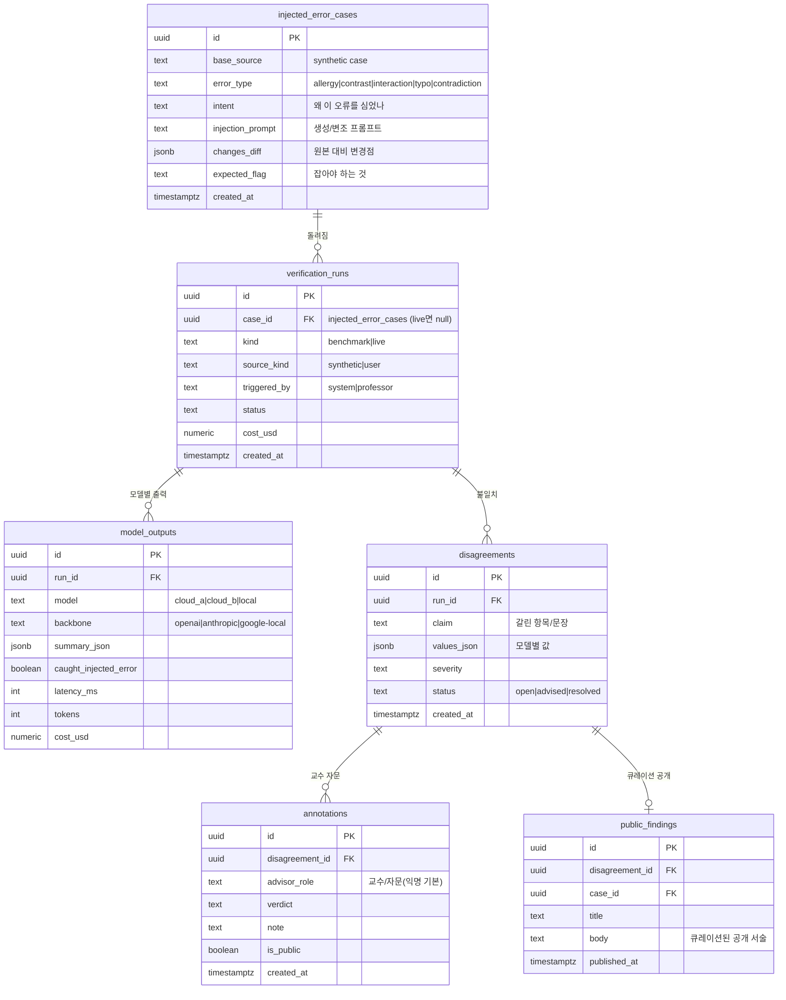

# ERD — 검증·감사 하네스 데이터 모델 (Draft v0.1 · 2026-07-15)

> ⚠️ **발견/설계 단계 전 초안.** brainstorming → 설계 승인 후 확정. [PRD.md](./PRD.md) 참조.
> 원칙: **공개-safe(합성)** 테이블과 **사용자 제출물(관리자 전용)** 테이블을 명확히 분리한다.

## 기존 (사용자 제출물 — 관리자 전용, 공개 금지)
`documents` → `chunks` / `summaries`. `/submit` 실사용 데이터. PHI 위험 → 절대 공개 화면에 미포함.

## 신규 (검증 레이어 — 합성 = 공개 safe)

## 접근 정책
- **공개 API(비번X):** `public_findings` + 연결된 case/disagreement의 **합성 부분만** 읽기.
- **관리자 API(서버 비번):** 전 테이블 + `documents`(사용자 제출물) + 재실행.
- RLS: 공개 읽기는 `public_findings` 등 화이트리스트만. 사용자 제출물 테이블은 익명 read 차단.

## Open questions (설계에서 확정)
- `model_outputs.caught_injected_error`를 자동 판정 vs 사람 라벨.
- live 실행 결과(교수 데이터)는 `verification_runs`에 남기되 원문은 `documents`처럼 비공개.
